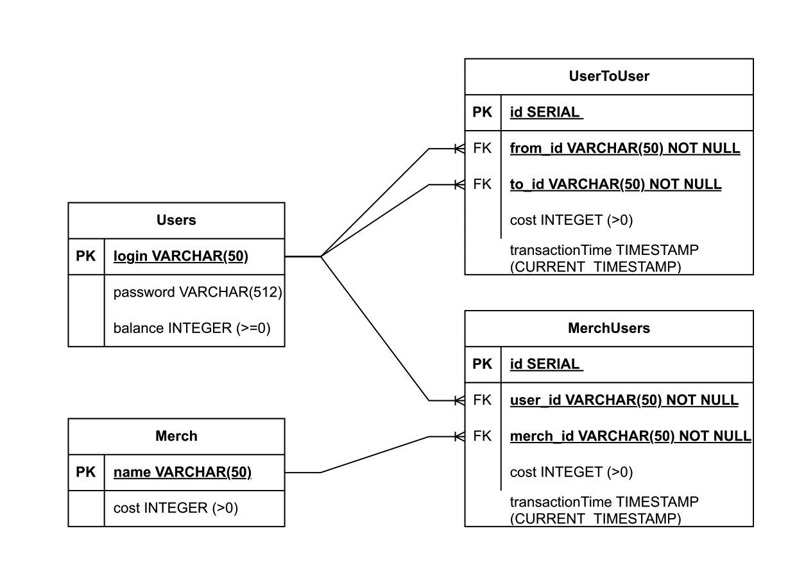

# AvitoBackend-trainee-assignment-winter-2025  

Тестовое на стажировку Golang

# Как запустить проект: 
`docker compose up --build`  
# Что еще нужно сделать в мечтах 
1 - подумать как не допустить ситуацию создания миллионов jwt токкенов 
2 - e2e тесты

# важное о Аунтификации (регистрации/входе)  
Выдвинутых требований к логину со сторону ТЗ не было  
Но и хранить любой логин мы не должны, как минимум это странно  
Логин приведен в строгий формат second_name.first_name  
(если у нас есть уже сотрудник с данным именем то добавляются цифры,  
сейчас это не играет роли, но в целом в развитии идеи)  
и домен @avito.ru  
Пароль должен быть не менее 4 символов
 

# Схема базы данных

# Текущие покрытие тестами
`ok  	avito	0.258s	coverage: 0.0% of statements `  
`?   	avito/internal/entity	[no test files]`   
`ok  	avito/internal/db	3.617s	coverage: 76.0% of statements`  
`ok  	avito/internal/js	1.180s	coverage: 100.0% of statements`  
`ok  	avito/internal/server	0.247s	coverage: 1.1% of statements`  
`ok  	avito/internal/service	0.726s	coverage: 80.4% of statements`  
`ok  	avito/pkg/auth	0.475s	coverage: 100.0% of statements`  
`ok  	avito/pkg/jwt	0.944s	coverage: 88.9% of statements`  
# ВАЖНОЕ `total:					(statements)		53.1%`

# Нагрузочное тестирование  
Для нагрузочного тестирования будет использована утилита `wrk`  
Скрипты с параметрами находятся в папке `script`  
Running 5m test @ http://localhost:8080/api/auth  
6 threads and 100 connections  
Thread Stats   Avg      Stdev     Max   +/- Stdev  
Latency     2.04ms    3.60ms 187.79ms   91.20%  
Req/Sec    14.15k     2.86k   37.15k    73.69%  
Latency Distribution  
50%  656.00us  
75%    2.87ms  
90%    5.29ms  
99%   13.31ms  
25349603 requests in 5.00m, 4.37GB read  
Non-2xx or 3xx responses: 25349603  
Requests/sec:  84470.66  
Transfer/sec:     14.90MB  

Running 5m test @ http://localhost:8080/api/info  
6 threads and 100 connections  
Thread Stats   Avg      Stdev     Max   +/- Stdev  
Latency     1.93ms    3.27ms  98.78ms   90.12%  
Req/Sec    16.09k     6.18k   47.40k    67.29%  
Latency Distribution  
50%  537.00us  
75%    2.62ms  
90%    5.17ms  
99%   14.32ms  
28798363 requests in 5.00m, 4.96GB read  
Socket errors: connect 0, read 0, write 0, timeout 1  
Non-2xx or 3xx responses: 28798363  
Requests/sec:  95965.67  
Transfer/sec:     16.93MB  

Running 5m test @ http://localhost:8080/api/sendCoin  
6 threads and 100 connections  
Thread Stats   Avg      Stdev     Max   +/- Stdev  
Latency     1.01ms    2.08ms  75.84ms   93.10%  
Req/Sec    20.77k     6.56k   53.64k    68.97%  
Latency Distribution  
50%  350.00us  
75%    0.97ms  
90%    2.30ms  
99%    9.56ms  
37169751 requests in 5.00m, 6.61GB read  
Socket errors: connect 0, read 0, write 0, timeout 1  
Non-2xx or 3xx responses: 37169751  
Requests/sec: 123858.01  
Transfer/sec:     22.56MB  

Running 5m test @ http://localhost:8080/api/buy/pen  
6 threads and 100 connections  
Thread Stats   Avg      Stdev     Max   +/- Stdev  
Latency     1.72ms    2.64ms  67.41ms   88.40%  
Req/Sec    16.98k     7.12k   58.78k    66.20%  
Latency Distribution  
50%  500.00us  
75%    2.40ms  
90%    4.74ms  
99%   12.04ms  
30376743 requests in 5.00m, 5.23GB read  
Socket errors: connect 0, read 0, write 0, timeout 85  
Non-2xx or 3xx responses: 30376743  
Requests/sec: 101257.40  
Transfer/sec:     17.86MB  

